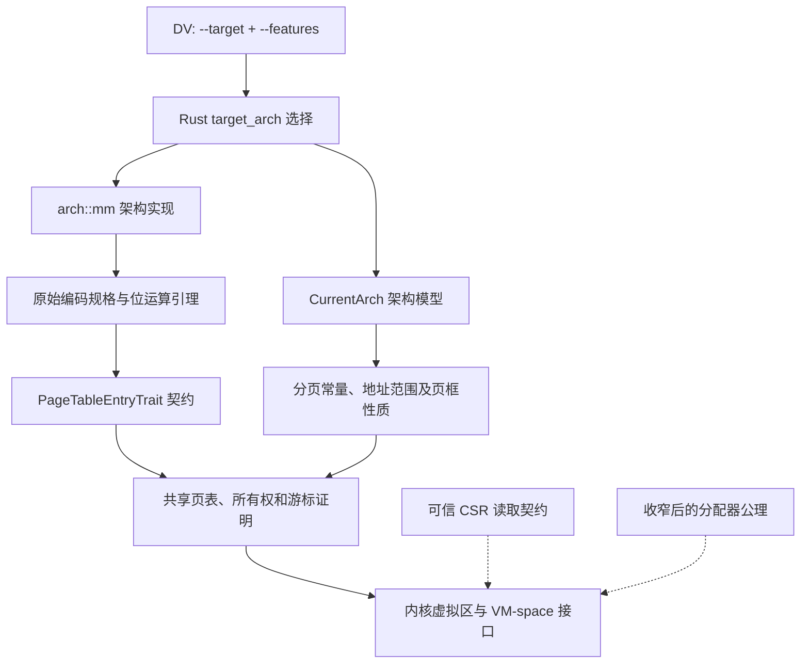

# VOSTD 多架构分页验证迁移说明

本文说明本次 RISC-V、LoongArch 验证迁移的目标、设计、实现方法、规格调整、可信边界和验证结果，供代码审查、后续维护及新增架构时参考。

文档依据当前 `polyverus` 代码及本次本地验证记录编写，日期为 2026-09-08。

## 1. 更新目标与完成范围

本次工作把已有架构的分页实现接入当前 VOSTD 的 Verus 验证体系：先参考 RISC-V 验证分支完成 Sv48 迁移，再沿用形成的方法完成 LoongArch 分页验证，同时保持 x86 默认验证路径可用。

完成的主要内容包括：

- 为 DV 增加目标架构参数，将验证和编译命令传递到实际 Rust target。
- 按目标架构选择实现、分页常量和证明模型。
- 为架构页表项建立原始位编码规格，证明其实现符合共享 PTE 接口契约。
- 将架构性质接入页框、页表所有权、游标、内核虚拟区及 VM-space 的现有证明。
- 显式建模当前页表根的硬件读取边界，并修正迁移暴露的共享规格问题。
- 加入 RISC-V、LoongArch 验证入口和 Linux/macOS CI 步骤。

这里的“架构迁移”指分页实现及其证明的迁移。当前配置是分页验证子集，未完成整套内核的启动、陷阱处理、设备驱动、硬件并发或可启动镜像验证。通过这些检查，也不代表所有映射属性组合均受到证明覆盖。

### 1.1 代码版本与参考来源

| 内容 | 对应版本 | 说明 |
| --- | --- | --- |
| 参考 RISC-V 证明 | `prove/arch-riscv`，`a3065369c` | 参考分支中的证明思路和位编码性质 |
| 本地 RISC-V 迁移 | `072210e85`，`prove arch riscv` | 将参考证明适配到当前接口、模型和工具链 |
| 本地 LoongArch 迁移 | `5dba26bfa`，`prove loongarch` | 包含后续 coding guideline 检查与四项修正 |
| DV 跨目标支持 | `3637b71`，`Add target selection for verify, focus and build` | 位于独立的 `dv` 子模块仓库 |

RISC-V 参考来源：[DID-Lab-SZU/vostd，a3065369c](https://github.com/DID-Lab-SZU/vostd/commit/a3065369c)。迁移过程中没有整体覆盖当前分支；涉及接口、执行行为或模型差异时，以当前代码为基准逐项适配。

## 2. 总体设计：架构实现如何进入共享证明

验证链路分为构建入口、架构模型、PTE 实现和共享内存证明几个层次。



图中的实线表示实现与证明之间的依赖；虚线表示调用方证明仍依赖的可信边界。

共享页表代码通过接口使用架构性质。位字段和寄存器差异保留在架构层，因此迁移的核心是证明“这个架构的实现满足接口要求”，再检查既有共享证明能否在该架构下成立。

### 2.1 共享架构模型

[ostd/specs/arch/model.rs](../ostd/specs/arch/model.rs) 定义两类主要接口：

| 接口 | 负责的内容 | 典型证明义务 |
| --- | --- | --- |
| `ArchPagingModel` | 分页配置与 PTE 可编码物理地址范围 | 页大小为正、地址上界兼容、上界按页对齐 |
| `ArchAddressSpaceModel` | 线性映射与 vmalloc 地址布局 | 基址对齐、范围有序、转换不溢出、所需地址为规范地址 |

`PagingConstsTrait` 继续提供基础页大小、页表层数、PTE 大小、地址宽度及符号扩展规则。`CurrentPagingConstsTrait` 连接当前共享页表证明需要的常量性质。

[ostd/specs/arch/mod.rs](../ostd/specs/arch/mod.rs) 按 target 选择 `CurrentArch`；[current.rs](../ostd/specs/arch/current.rs) 提供共享调用方使用的证明入口，例如：

- `valid_frame_paddr`：当前页框模型接受的物理页地址。
- `lemma_paddr_to_vaddr_properties`：线性映射范围、内核下界和反向转换性质。
- `lemma_max_paddr_range`：页框地址上界与线性映射容量相容。
- `current_page_table_read_req`：读取当前页表根时需要满足的架构条件。

RISC-V 和 LoongArch 均使用 ghost 架构标记类型。对应模型还保留实现分页常量 trait 的类型，以便在非本架构 target 下检查架构常量模型；在本架构 target 下，模型关联实际 `arch::mm::PagingConsts`。

### 2.2 区分硬件编码范围与被跟踪页框范围

迁移没有把所有能够写入 PTE 的地址都视为有效的被跟踪页框。

```text
valid_arch_paddr_for<A>(pa)
    = pa 按基础页对齐，且 pa < A 的 PTE 编码上界

valid_tracked_frame_paddr_for<A>(pa)
    = pa 按基础页对齐，且 pa < MAX_PADDR
```

当前 `MAX_PADDR` 为 `0x8000_0000`，即被跟踪模型使用的 2 GiB 上界。RISC-V 的 PTE 物理地址编码宽度为 56 位，LoongArch 当前实现的掩码保留 48 位地址范围，两者都比该模型范围大。

因此，任意原始 PTE 的 `paddr()` 只需保证地址提取正确且按页对齐；`paddr < MAX_PADDR` 由构造前提及拥有该页表项的模型不变量承担。把这两个层次混为一谈，会对任意编码字施加不成立的保证。

## 3. 构建入口迁移

### 3.1 DV 支持真正的跨目标验证

原先 DV 向 `cargo-verus` 传入固定的 `x86_64-unknown-none`。本次在 `verify`、`focus`、`build` 的参数结构中加入 `--target`，通过 `ExtraOptions.rust_target` 传递到命令构造函数。

默认 target 仍为 x86；原有命令保持可用。例如：

```bash
cargo dv verify --targets ostd \
  --target loongarch64-unknown-none-softfloat \
  --features loongarch_paging_verification
```

这里两个参数含义不同：

- `--targets ostd` 选择 DV 要验证的项目目标。
- `--target loongarch64-unknown-none-softfloat` 选择 Rust 编译目标，影响 `target_arch`、依赖及目标代码生成。

Cargo 的 target 和 feature 参数位于 `--` 之前；Verus 的模块选择等参数位于 `--` 之后。仅模拟一个架构配置条件，不能替代真实 target 带来的依赖和编译环境选择。

### 3.2 架构选择与验证 feature

[ostd/src/lib.rs](../ostd/src/lib.rs) 根据 `target_arch` 加载对应的 `arch` 模块，使上层统一使用 `crate::arch::mm`。

| 架构 | Rust target | 验证 feature | 完整验证入口 |
| --- | --- | --- | --- |
| x86 | `x86_64-unknown-none` | 默认配置 | `make` |
| RISC-V | `riscv64imac-unknown-none-elf` | `riscv_paging_verification` | `make verify-riscv` |
| LoongArch | `loongarch64-unknown-none-softfloat` | `loongarch_paging_verification` | `make verify-loongarch` |

新增 feature 将尚未进入验证范围的启动、CPU、陷阱和设备模块隔离开，保留共享内存代码需要的中断、计时接口。LoongArch 的验证 IRQ 文件保留原有 CSR 操作；这些硬件操作并未因进入该配置而自动获得形式化证明。

[rust-toolchain.toml](../rust-toolchain.toml) 增加对应标准库 target。[Makefile](../Makefile) 增加命令入口，Linux 和 macOS 工作流增加相应检查步骤。

## 4. PTE 证明的迁移方法

### 4.1 先确定共享接口要求

[PageTableEntryTrait](../ostd/src/mm/page_table/mod.rs) 是架构实现进入共享证明的主要边界。

| 操作 | 共享契约要求 |
| --- | --- |
| `new_absent` | 产生零值缺席项；地址在被跟踪模型中有效；`is_present` 为假 |
| `new_page` | 在架构前提成立时，保留按页截断的地址、产生有效终端项、属性精确往返 |
| `new_pt` | 保留子页表地址、产生有效项，并在 level 1 以上非终端 |
| `paddr` | 精确提取地址，并保证基础页对齐 |
| `prop` | 返回原始字的精确属性解码 |
| `set_prop` | 在其前提内，保留地址、有效性和原有终端状态，并得到请求的属性 |
| `as_usize` | 返回原始编码字 |

共享 setter 对缺席项有“不改变”的契约，但具体架构可以通过 `set_prop_req` 排除不支持的调用。LoongArch 当前就排除了缺席项更新。上层调用者必须满足这一前提，不能仅根据 trait 方法存在就任意调用。

### 4.2 执行代码采用最小适配

迁移对两种架构采用相同的适配方向：

1. 将旧的关联常量接口适配为当前分页 trait 的方法及对应 spec 方法。
2. 使用仓库已有的 verified bitflags，将 `FLAG` 引用适配为 `FLAG()`。
3. 为 `Pod`、`Default`、`new_absent`、`as_usize` 补充当前验证接口需要的显式实现。
4. 保留原来的位布局、缓存策略分支、错误路径及硬件操作。
5. 只在构造顺序与接口契约冲突时提取小范围 helper，并证明最终编码与原实现相同。

这一步的目标是让现有执行逻辑能够被 Verus 描述和检查。发现原代码行为不符合理想性质时，应给出准确规格和限制，不能直接假定期望的性质成立。

### 4.3 从位运算证明到接口性质

LoongArch 的证明主要组织在 [arch/loongarch/mm/mod.rs](../ostd/src/arch/loongarch/mm/mod.rs)，可以按以下层次阅读：

| 层次 | 代表定义 | 作用 |
| --- | --- | --- |
| 原始字模型 | `raw_is_huge`、`raw_paddr`、`decode_flags`、`decode_priv`、`decode_cache` | 数学上定义编码的含义 |
| 原始编码模型 | `raw_set_bits`、`raw_set_prop_spec` | 精确描述现有 setter 写出的每一个相关位 |
| 常量与表达式衔接 | `lemma_flag_constants`、`lemma_encode_matches`、`lemma_decode_matches` | 把 verified bitflags、`ilog2` 和转换宏连接到位表达式 |
| 位向量证明 | `lemma_new_page_bits`、`lemma_new_pt_bits`、`lemma_set_prop_bits` | 证明掩码、标志位、地址及缓存位关系 |
| 接口证明 | `lemma_new_page`、`lemma_new_pt`、`lemma_set_prop` | 将位性质提升为 `PageProperty` 和 PTE 接口性质 |
| 共享证明入口 | `lemma_page_table_entry_properties` | 提供通用页表代码需要的量化性质 |

位级关系使用 `bit_vector` 求解，固定常量使用 `compute_only`，其余结构关系由普通证明衔接。这样的拆分减少了在一个函数中同时处理宏展开、枚举、量词和位运算的负担。

## 5. RISC-V 迁移的具体处理

### 5.1 Sv48 模型与当前接口对齐

RISC-V 模型使用四级页表、4 KiB 基础页、8 字节 PTE、每节点 512 项，以及 48 位符号扩展虚拟地址。迁移将参考分支的证明适配到当前模型、所有权接口及验证工具链。

构造流程使用私有 `new_paddr` helper 设置 VALID，使 `new_page` 可以在满足 setter 前提的状态上更新属性；`new_pt` 返回该 helper 的结果。对外构造出的编码保持原有行为。

### 5.2 保留当前 ACCESSED/DIRTY 行为

当前 RISC-V setter 会清除 ACCESSED/DIRTY。参考分支中写入这些位的行为变更没有直接迁入。

为了证明 `result.prop() == input_prop`，当前往返契约要求：

- 输入属性有效。
- 映射包含 R，当前覆盖域不包含 execute-only 映射。
- 缓存策略为 Writeback 或 Uncacheable。
- 输入 ACCESSED/DIRTY 均为零。

这保留了执行行为，同时让精确属性往返的证明与实现相符。

### 5.3 附加的编码合法性证明

RISC-V 增加 `pte_wf(level)` 以及缺席项、子页表项、对齐叶子项和属性更新的相关引理，描述编码、保留位与不同页级的对齐要求。

这些是局部编码性质。通用页表不变量目前没有整体纳入 `pte_wf(level)`，因此不能把它们描述为所有运行中页表都已维持的全局硬件合法性证明。

RISC-V 的独立说明见 [riscv-verification.md](riscv-verification.md)。

## 6. LoongArch 迁移的具体处理

### 6.1 复用证明结构，重新建立位编码模型

LoongArch 复用了跨目标入口和共享架构模型，但其 PTE 位编码单独建模。

| 属性 | RISC-V 当前模型 | LoongArch 当前模型 |
| --- | --- | --- |
| 基础页、PTE 大小 | 4096 字节、8 字节 | 4096 字节、8 字节 |
| 页表层数、每节点项数 | 4、512 | 4、512 |
| 页表虚拟地址模型 | 48 位符号扩展 | 48 位符号扩展；不覆盖所有直接映射窗口 |
| PTE 地址编码上界 | `2^56` | 当前实现掩码对应 `2^48` |
| 最高叶子页级常量 | 4 | 1，当前只覆盖 4 KiB 叶子 |
| 属性往返的 A/D 条件 | ACCESSED、DIRTY 输入为零 | DIRTY 输入必须置位；ACCESSED 按现有编码处理 |
| 属性往返的缓存策略 | Writeback、Uncacheable | Writeback、WriteCombining |

LoongArch 的 `GLOBAL_OR_HUGE` 位根据条目种类有不同含义，`GLOBAL_IN_HUGE` 又与普通页物理地址的 bit 12 重叠。证明必须同时考虑标志解码和地址提取，不能只逐位检查权限。

### 6.2 使用精确的内部 setter 契约

原 `new_page` 先构造仅含物理地址的临时字，再调用属性 setter，最后补上基本页标志。临时字尚未 present，而共享 setter 的缺席项契约不适合描述这段初始化。

迁移把原 setter 的执行体提取为 `set_prop_inner`：

```text
new_page
  → 用物理地址构造临时字
  → set_prop_inner：按原逻辑编码属性
  → 加入基本页标志

PageTableEntryTrait::set_prop
  → 检查证明前提
  → set_prop_inner：使用相同执行逻辑
```

这里的“检查证明前提”由 Verus 静态完成，没有新增运行时判断。内部 helper 保证结果等于 `raw_set_prop_spec`；外部方法再证明共享接口所需的地址及属性性质。

### 6.3 构造与属性更新的实际覆盖域

`supported_prop` 描述原始编码器接受的有效输入：合法 flags，以及 Writeback、WriteCombining 或 Uncacheable。`roundtrip_prop` 进一步要求 DIRTY 置位，并排除当前不能正确往返的 Uncacheable。

| 接口 | 额外前提 |
| --- | --- |
| `new_page` | `paddr < MAX_PADDR`、level 1、`roundtrip_prop`；支持 USER/GLOBAL |
| `set_prop` | 旧项 present、非 huge、原始字 bit 12 为零；新属性无 GLOBAL，且满足 `roundtrip_prop` |
| `set_prop_inner` | `supported_prop`；保证精确原始编码，不承诺所有输入都能按原属性读回 |

对不满足前提的调用，当前证明不给出共享契约保证。原始执行体及其错误路径仍然保留。

### 6.4 四类已经验证的编码反例

`lemma_legacy_encoding_limits` 对当前编码模型证明了以下反例：

| 原有行为 | 具体反例 | 为什么影响证明范围 |
| --- | --- | --- |
| setter 清除 IS_BASIC | 全局基本页 `0x1000` 更新后，GLOBAL 被解读为 HUGE，提取地址变为 `0` | 不能无条件证明地址保持 |
| 地址 bit 12 被解读为 GLOBAL | 非全局基本页 `0x1000` 更新后，被解码为 GLOBAL | 不能无条件证明权限属性往返 |
| MAT=0 解码不一致 | Uncacheable 编码为 MAT=0，读取时得到 Writeback | 不能证明 Uncacheable 精确往返 |
| 强制 DIRTY | 输入只有 R，读回为 R \| DIRTY | 输入未置 DIRTY 时不能满足属性相等 |

这些是原实现的行为，本次没有修改其运行逻辑。限制来自已验证的编码事实，而不是简单为了让求解器通过而任意收紧前提。

### 6.5 避免空泛的证明

`lemma_supported_mapping_witness` 构造了物理地址为 `0x2000`、USER、Writeback、DIRTY 的实例，证明它满足构造前提，能够更新，并且更新结果仍满足再次更新的前提。

这个实例用于证明相关规格的覆盖域非空，并不证明任意完整内核状态都能构造出来。实际系统集成还需要页框、页表和内存所有权等既有前提。

独立说明见 [loongarch-verification.md](loongarch-verification.md)。

## 7. 共享证明中的架构假设调整

### 7.1 内核地址下界与线性映射基址不能默认相等

当前实现中，LoongArch 的 `KERNEL_BASE_VADDR` 为 `0x9000_0000_0000_0000`，而线性映射基址仍为 `0xffff_8000_0000_0000`，vmalloc 基址为 `0xffff_c000_0000_0000`。

此前一些证明依赖 x86 下内核下界与线性映射基址相等所带来的隐含推理。LoongArch 完整验证因此在页框及 DMA reader/writer 等位置失败。

修正后的 `lemma_paddr_to_vaddr_properties` 显式建立：

```text
0 < KERNEL_BASE_VADDR <= paddr_to_vaddr(pa)
LINEAR_MAPPING_BASE_VADDR <= paddr_to_vaddr(pa) < VMALLOC_BASE_VADDR
```

这些结论在实际常量关系上获得证明，没有修改运行时地址常量。

### 7.2 将页表范围引理限定到可管理的 vmalloc 地址

LoongArch 的内核下界包含直接映射窗口，不能据此断言整个内核区间都满足共享页表的高半区规范地址规则。

`lemma_kernel_range_valid` 因此要求 `r.start >= VMALLOC_BASE_VADDR`，再证明该范围位于共享页表管理的高半区。分配器的可信范围契约记录相应下界，调用点使用分配结果建立该条件。

这项修改证明的是当前 vmalloc 路径；没有建立 LoongArch 全部直接映射窗口的硬件模型。

### 7.3 映射前提只约束支持的叶子页级

原非跟踪内核映射 API 对所有 `PagingLevel` 都要求 `new_page_req`。LoongArch 只接受 level 1，若保留无条件全称量词，则该 API 的前提根本不能满足。

修改后的规格形如：

```text
forall pa, level:
    1 <= level <= HIGHEST_TRANSLATION_LEVEL
    ==> new_page_req(pa, level, prop)
```

这与页面拆分结果的受支持页级保证衔接。LoongArch 的有效实例也证明了这项修正后的架构前提。

## 8. 可信边界与 guideline 审查修正

### 8.1 当前页表根读取

共享 VM-space 的 reader/writer 需要确认目标页表是否为当前活动页表。硬件读取通过显式 `assume_specification` 连接到不可解释的当前根模型。

| 架构 | 源码依据 | 契约内容 |
| --- | --- | --- |
| RISC-V | `riscv` 0.11.1 的 `register/satp.rs` | 读取 SATP，提取 PPN 后左移 12 位，关联到活动根模型 |
| LoongArch | `loongArch64` 0.2.6 的 `pgdl.rs`、`pgdh.rs` 和 CSR 宏 | 读取 CSR 0x19/0x1a；在两者相等的前提下返回根模型 |

LoongArch 执行函数包含 `assert_eq!(pgdl, pgdh)`。审查后将寄存器相等放入调用前提，而非只在正常返回后声明相等：

```text
current_page_table_read_req()
    LoongArch：PGDL 模型值 == PGDH 模型值
    x86 / RISC-V：true
```

`VmSpace::reader`、`writer` 显式要求该条件；相应辅助规格和 rustdoc 同步更新。没有加入无条件的寄存器相等假设，也没有宣称底层硬件操作满足 `no_unwind`。

当前模型仍假定一次 VM reader/writer 操作期间根寄存器保持稳定。CSR 特权、寄存器副作用、地址空间切换并发、页表激活和 TLB 刷新均保留为未证明的硬件边界。

### 8.2 收窄分配器公理，证明偏移算术

审查发现，旧 `kvirt_alloc_range_bounds` 公理没有限制 `map_offset`，却无条件承诺它不超过成功分配的长度。例如成功分配 4096 字节后，用偏移 4097 调用该公理，便能推出矛盾。该问题早于本次迁移，但本次共享证明继续依赖它，因此一并处理。

修正分为两部分：

| 定义 | 当前职责 |
| --- | --- |
| `axiom_kvirt_alloc_range_bounds` | 只对按页对齐的申请，给出成功分配的长度、对齐及 vmalloc 区间事实；不接受偏移参数 |
| `lemma_kvirt_alloc_range_bounds` | 在 `map_offset <= area_size` 前提下，实际证明偏移落在范围内、加法不溢出及范围为正 |

同时，跟踪页映射 API 改为显式要求其尺寸、对齐和容量条件成立，不能再用允许 panic 的条件替代这些证明义务。原来的 `assume(range.end > 0)` 被删除，因为正性已经由分配范围推导出来。

保留的分配器公理是对原公理的重命名和收窄。当前分配器执行体仍是未验证的占位实现，因此不能把这项工作描述成“分配器本身已验证”。

### 8.3 文档与规格表达清理

按照 [coding guidelines](coding-guidelines/README.md) 的相关要求，还完成了：

- 为架构模块和关键 PTE API 补充 `Verified Properties`，说明 Safety、功能性质、前提和后置条件。
- 将 LoongArch 根寄存器读取前提写入 VM reader/writer 文档。
- 为新增证明函数说明前提、结论和保留的可信边界。
- 删除已经使用 `returns` 的 getter 和硬件契约中的无用返回值绑定。
- 删除旧的 LoongArch `set_prop_properties` 中的 `admit()` 占位。

本次没有新增 `external_body`、`assume()` 或 `admit()` 来绕过失败。硬件的外部规格和收窄后的分配器公理仍需作为可信边界审查；验证通过并不会自动证明它们的真实性。

## 9. 验证与回归结果

最终实现使用配置的 Rust 1.98.0 / Verus 工具链，在 macOS 上完成验证。

| 检查 | 最终结果 |
| --- | --- |
| LoongArch：`make verify-loongarch` | 1553 项 OSTD 验证通过，0 错误 |
| x86：`make` | 1565 项 OSTD 验证通过，0 错误 |
| RISC-V：`make verify-riscv` | 1554 项 OSTD 验证通过，0 错误 |
| 完整验证中的依赖证明 | 通过 |
| LoongArch release 库编译 | 完整验证后使用 `--no-verify` 编译通过 |
| 修改过的 Rust/Verus 文件格式 | `verusfmt --check` 通过 |
| 差异检查 | `git diff --check` 通过 |
| 静态后处理检查 | 0 错误；注释、新文件及公理重命名警告经过检查 |

RISC-V 迁移阶段还记录了其 release 编译通过，以及 DV 的 13 项库/二进制单元测试通过。DV 的旧集成测试依赖缺失的 fixture workspace，不能列为已通过的检查。

验证项数量用于记录工具输出，不是代码覆盖率，也不表示所有目标 API 的运行路径都受到证明覆盖。不同架构的条目数量可以不同。

验证采用以下顺序：先用 `focus` 对新增 PTE 模块迭代，再检查共享依赖模块，最后运行完整验证、跨架构回归及编译。`focus` 只检查选中的证明，不能替代完整验证；`--no-verify` 只用于此前已完成验证的独立编译步骤。

Linux 和 macOS CI 已加入两个架构的验证命令，但本次没有执行远程 CI，也没有进行启动或真实硬件测试。动态 GitHub 审查规则因先前 API 限流而不可用，最终使用静态规则。历史 x86 文件存在 verusfmt 0.7.2 的旧解析问题，未将全仓格式化宣称为已通过。

## 10. 复现命令

### 10.1 准备仓库与工具链

先确保主仓库记录了可获取的 DV 提交，相关发布状态见下一节。对已经正确发布的仓库：

```bash
git submodule update --init --recursive
rustup target add x86_64-unknown-none \
  riscv64imac-unknown-none-elf loongarch64-unknown-none-softfloat
make verus
```

如果仓库已经配置并构建好 Verus，则不必重复 bootstrap。

### 10.2 定向验证

```bash
cargo dv focus --targets ostd --target riscv64imac-unknown-none-elf \
  --features riscv_paging_verification -- --verify-only-module arch::mm

cargo dv focus --targets ostd --target loongarch64-unknown-none-softfloat \
  --features loongarch_paging_verification -- --verify-only-module arch::mm
```

检查共享模块时，将模块选择改为实际模块路径，例如 `mm::kspace::kvirt_area` 或 `mm::vm_space`。

### 10.3 完整验证与编译

```bash
make
make verify-riscv
make verify-loongarch

cargo dv build --targets ostd --target loongarch64-unknown-none-softfloat \
  --features loongarch_paging_verification -- --no-verify
```

## 11. DV 子模块与发布状态

DV 的代码位于独立 Git 子模块。主仓库的 `dv` 条目保存提交 SHA，不会把子模块的文件内容自动作为普通目录收入主仓库提交。

截至本文编写时，本地状态为：

- 主仓库在 `polyverus`，HEAD 为 `5dba26bfa`。
- DV 工作区位于 `add-target-support`，HEAD 为 `3637b71`。
- 主仓库仍记录旧 DV 提交 `6d6502d`，所以 `git status` 显示 `M dv`。
- `.gitmodules` 仍指向 `https://github.com/asterinas/rust-deductive-verifier.git`。

这意味着：当前本地验证已经使用新版 DV，但仅检出主仓库现有提交并初始化旧 gitlink，不会自动得到本次 `--target` 支持。完成可复现发布还需要先发布 DV 提交，再提交主仓库中的子模块配置和 gitlink。

发布方式可以是独立 DV fork，也可以把 DV 提交放到同一 `DID-Lab-SZU/vostd` 仓库的专用分支，再让 `polyverus` 引用它。先前讨论过的同仓库方式如下；这些命令是发布步骤示例，不代表本文编写过程中已经执行：

```bash
git -C dv push https://github.com/DID-Lab-SZU/vostd.git \
  HEAD:refs/heads/dv-add-target-support
git submodule set-url dv https://github.com/DID-Lab-SZU/vostd.git
git submodule set-branch --branch dv-add-target-support dv
git add .gitmodules dv
git commit -m "Update dv for cross-target verification"
git push origin polyverus:polyverus
```

该方式保留子模块结构，DV 源码位于专用分支，`polyverus` 固定引用其提交。使用者通过 `git clone --branch polyverus --recurse-submodules <仓库地址>` 获取完整工作区。

## 12. 关键文件导航

| 文件或目录 | 主要职责 |
| --- | --- |
| [dv/src/main.rs](../dv/src/main.rs)、[dv/src/verus.rs](../dv/src/verus.rs) | 解析和传递 target、features、Verus 参数 |
| [ostd/src/lib.rs](../ostd/src/lib.rs) | 选择当前架构执行模块 |
| [ostd/specs/arch/model.rs](../ostd/specs/arch/model.rs) | 共享分页和地址空间模型 |
| [ostd/specs/arch/current.rs](../ostd/specs/arch/current.rs) | 当前架构的共享证明入口和根读取前提 |
| [ostd/specs/arch/riscv](../ostd/specs/arch/riscv/mod.rs)、[loongarch](../ostd/specs/arch/loongarch/mod.rs) | 架构实例、常量和硬件读取契约 |
| [RISC-V PTE](../ostd/src/arch/riscv/mm/mod.rs)、[LoongArch PTE](../ostd/src/arch/loongarch/mm/mod.rs) | 执行编码、数学规格、位运算及接口证明 |
| [ostd/src/mm/page_table/mod.rs](../ostd/src/mm/page_table/mod.rs) | 共享 PTE 契约 |
| [ostd/src/mm/kspace/kvirt_area.rs](../ostd/src/mm/kspace/kvirt_area.rs) | 内核映射前提、分配器边界及偏移证明 |
| [ostd/src/mm/vm_space.rs](../ostd/src/mm/vm_space.rs)、[对应规格](../ostd/specs/mm/vm_space.rs) | VM reader/writer 的根读取义务 |
| [Makefile](../Makefile)、[rust-toolchain.toml](../rust-toolchain.toml) | 验证入口与编译目标 |
| [Linux CI](../.github/workflows/ci.yml)、[macOS CI](../.github/workflows/ci-macos.yml) | 跨架构验证步骤 |

## 13. 后续扩展建议

### 13.1 LoongArch 的下一步

优先独立处理已证明存在的 IS_BASIC/GLOBAL 解码问题和 Uncacheable 解码问题。它们涉及运行语义变更，应作为明确的功能修复审查；修复后再更新原始编码模型、反例、接口前提和回归证明。

DIRTY 强制置位来自 PageModifyFault workaround，需要结合异常处理设计决定是否改变，不能只为放宽规格而删除。

如需支持大页，还需要证明不同层级的对齐、GLOBAL/HUGE 位解释、地址提取、叶子识别及拆分性质，并连接到共享所有权不变量。只修改 `HIGHEST_TRANSLATION_LEVEL` 不足以建立大页支持。

若要提升硬件和系统层面的保证，应进一步验证或细化 CSR/TLB 状态转换、地址空间切换协议、分配器状态和实际启动路径。

### 13.2 新增架构时可复用的步骤

1. 固定原始执行行为和验证范围，明确已有问题与允许的适配。
2. 接通真实 Rust target 和最小验证 feature。
3. 实现分页常量与架构模型，区分编码地址范围和被跟踪页框范围。
4. 为原始 PTE 字建立精确编码/解码规格。
5. 分层证明位关系、属性往返、地址保持及共享接口契约。
6. 用可满足的实例检查前提；对不成立的期望性质给出反例。
7. 运行共享模块验证，消除写死的架构假设，检查量词是否覆盖了不支持的页级。
8. 审查每个可信边界，优先把数学结论改为实际证明，将状态义务放入调用前提。
9. 完成默认架构回归、其他架构回归和目标编译，再发布可获取的工具子模块提交。

